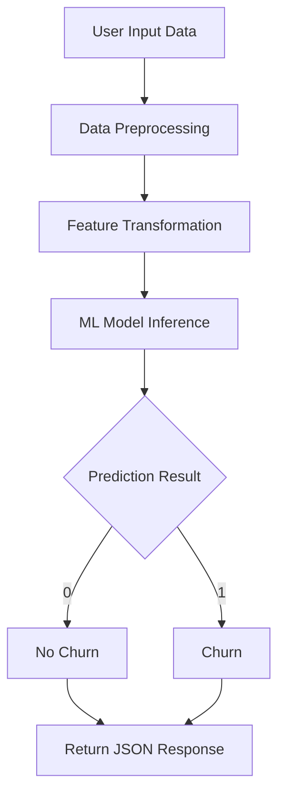
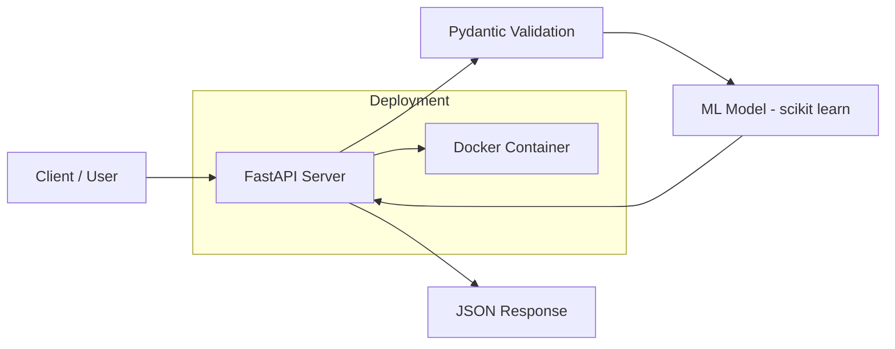
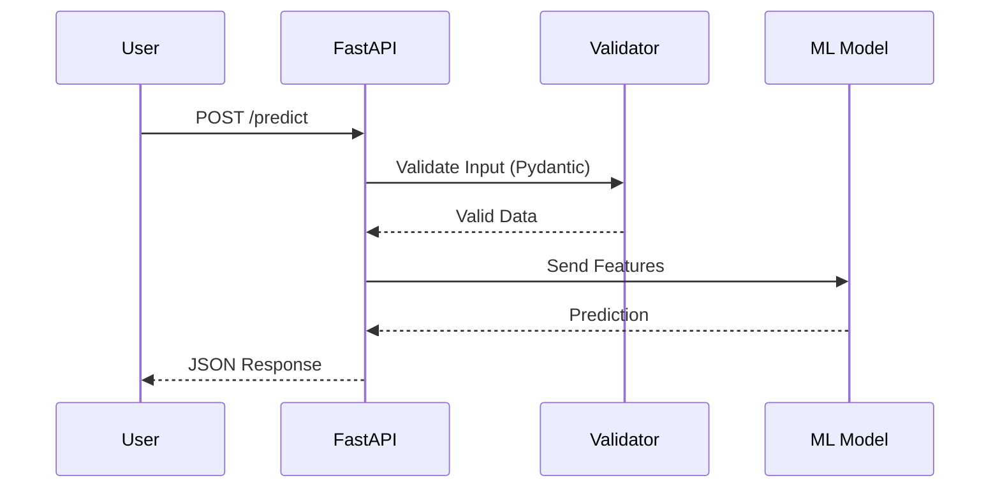
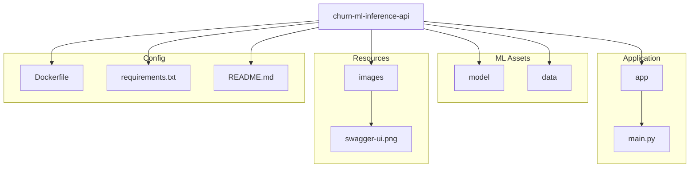

# Customer Churn Prediction – ML Inference API

An end-to-end machine learning inference system for predicting customer churn.
The project demonstrates how to train a machine learning model, expose it as a
REST API using FastAPI, and deploy it in a reproducible way using Docker.
 
---

##  Features

- End-to-end ML pipeline (data preprocessing → model training → inference)
- Trained classification model using scikit-learn
- FastAPI-based REST API for real-time predictions
- Input validation using Pydantic schemas
- Fully containerized with Docker for portability and reproducibility

---

##  Problem Statement
 
Customer churn prediction is a common real-world machine learning problem.
Given customer attributes such as credit score, age, balance, and activity
status, the system predicts whether a customer is likely to churn.

---

## How It Works


---

## System Architecture


---

## API Request Flow


---

##  Tech Stack

- **Language:** Python
- **Machine Learning:** scikit-learn
- **API Framework:** FastAPI
- **Containerization:** Docker
- **Runtime:** Uvicorn

---
## Project Structure (Visual)


---

##  Running the Application (Docker)

### Prerequisites
- Docker installed and running

### Build the Docker image
```bash
docker build -t churn-ml-api .
```
## Run the container
```
docker run -p 8000:8000 churn-ml-api
```
##  API Preview (Swagger UI)
Below is a preview of the FastAPI Swagger UI showing the /predict endpoint:

## API Usage
Open Swagger UI:
```
http://127.0.0.1:8000/docs
```
Example Request:
```
{
  "credit_score": 600,
  "age": 40,
  "tenure": 3,
  "balance": 60000,
  "products_number": 2,
  "credit_card": 1,
  "active_member": 1,
  "estimated_salary": 50000,
  "country_Germany": 0,
  "country_Spain": 1,
  "gender_Male": 1
}
```
Example Response:
```
{
  "churn_prediction": 0
}
```
##  Live Deployment
```
https://churn-ml-inference-api.onrender.com/docs
```

